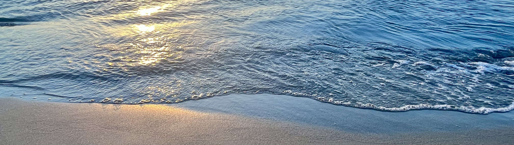

### Hi there! I'm Meruert
## About me
I'm on my way to becoming a front-end developer, currently studying Javascript. My goal is to become a specialist in this field of programming. 👩🏻‍💻✨

### Contacts
- [LinkedIn](https://www.linkedin.com/in/meruert-amantay/) 🌱
- [Discord](https://discordapp.com/users/431131454496309259/) 👾

### My CV with my projects
- [CV](https://merumerum.github.io/rsschool-cv/)  🌠
<!--
**merumerum/merumerum** is a ✨ _special_ ✨ repository because its `README.md` (this file) appears on your GitHub profile.

Here are some ideas to get you started:

- 🔭 I’m currently working on ...
- 🌱 I’m currently learning ...
- 👯 I’m looking to collaborate on ...
- 🤔 I’m looking for help with ...
- 💬 Ask me about ...
- 📫 How to reach me: ...
- 😄 Pronouns: ...
- ⚡ Fun fact: ...
-->
